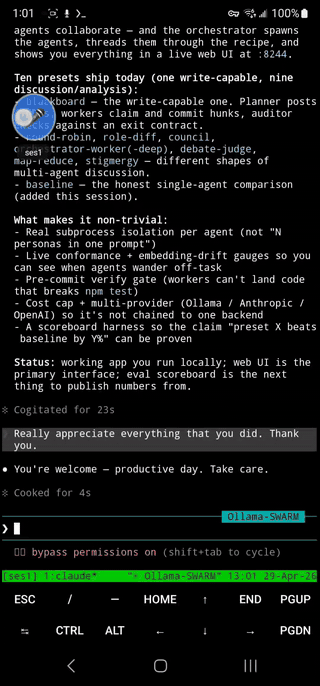
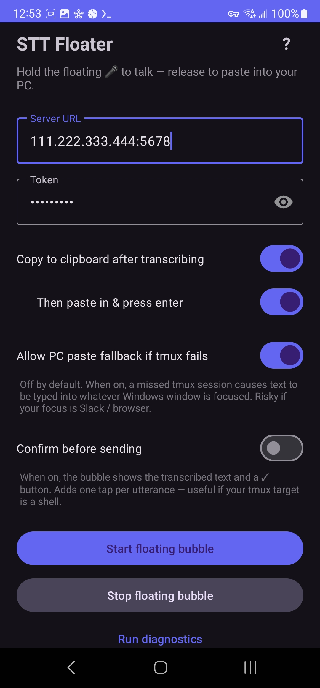

# STT Floater

> **Designed to pair with [claude-sessions-app](https://github.com/kevinkicho/claude-sessions-app).**
> STT Floater routes transcribed speech into named tmux sessions (`ses1`, `ses2`, `ses3`, …) on your PC. Those sessions are managed by **claude-sessions-app**, which you should install first. Without it (or some equivalent tmux setup), there's nowhere for the transcribed text to land except a generic Windows paste.
>
> **Connectivity is Tailscale-only.** Phone and PC must be on the same Tailnet — the phone reaches the PC at its `100.x.x.x` Tailscale IP. The server refuses non-Tailnet origins as a defense-in-depth measure. No public exposure, no port forwarding.

<p align="center">
  
  <br/>
  <em>Tap the bubble, speak, tap again — text + Enter lands in your active tmux session.</em>
</p>

<details>
<summary><strong>Settings screen</strong> (click to expand)</summary>
<br/>
<p align="center">
  
</p>
</details>

Dictate from your Android phone into your Windows PC or directly into a live tmux session, over Tailscale. Originally built to drive [Claude Code](https://claude.com/claude-code) conversations running in PowerShell or WSL tmux without typing on the Android keyboard.

Tap a floating bubble on your phone, speak, tap again. Audio is uploaded over your Tailnet, transcribed by [faster-whisper](https://github.com/SYSTRAN/faster-whisper) on your PC, and delivered to one of three places depending on your settings:

1. **tmux session** (recommended) — typed directly into a named tmux session running on your PC via `tmux send-keys`, no window focus required.
2. **Phone clipboard** — copied to Android's clipboard for you to paste anywhere on the phone.
3. **PC focused window** (opt-in fallback) — pasted into whichever Windows window has focus. Off by default to avoid dictation landing in Slack / a browser tab if tmux misses.

The floating bubble shows a live pill under the mic indicating where your text will go: `ses3` (auto-detected), `• ses2` (you picked it from the menu), `📋` (clipboard mode), or `(searching…)` if no tmux session is attached. The pill turns red with `⚠` if the last send to your picked target didn't actually land there.

## The problem this solves

You have a Windows PC running interactive CLIs like [Claude Code](https://claude.com/claude-code). You access the PC from your Android phone or tablet — maybe via RealVNC, maybe via SSH-into-tmux from Termux. Typing through the Android keyboard inside a remote-desktop session is painful, and even in SSH it's slow.

This app turns your phone's microphone into a dictation bridge, with three routing modes so you can pick what fits: paste into the focused Windows window, copy to phone clipboard, or write directly into a named tmux session shared across all attached devices.

## How this was built

All of the code in this repo was written by **[Claude Code](https://claude.com/claude-code) powered by Claude Opus 4.7** (Anthropic's CLI coding assistant). The maintainer [@kevinkicho](https://github.com/kevinkicho) described the need, ran every build on a real Galaxy S22 Ultra + Galaxy Tab S7 + Windows 11 setup, and fed concrete feedback — observed errors, toast messages, wrong behaviors — back to Claude for each iteration. Claude handled the architecture, the Kotlin / Python / XML, the ADB / Gradle plumbing, and diagnosed the design pivots along the way.

Notable design pivots, all driven by real-device testing:

- First approach used Android's `SpeechRecognizer` directly. On a Galaxy S22, Bixby starved the mic and all three recognizer paths failed — pivoted to recording raw audio with `AudioRecord` and transcribing server-side with Whisper.
- First output path only pasted into the focused Windows window via `pyautogui`. Added clipboard mode, then tmux-send-keys mode, and finally made tmux the default routing path (with PC paste as opt-in fallback) once it became clear that "type into a random Windows window" is the most embarrassment-prone failure mode in the system.
- For other Android apps (not Termux), added an Accessibility Service that finds the focused editable field, sets text, and clicks the app's Send button (multilingual keyword match: en/ko/ja/zh/es/fr/de/it/ru).
- Polling for "which tmux session is active right now?" used to fire every 4 seconds while the bubble was up — meaningful battery drain for a label that updates infrequently. Replaced with on-demand fetch (when the bubble service starts, when you tap the mic, when you pick "Auto" from the menu).
- Original WSL `tmux list-sessions -F '#{session_name}'` call was silently broken on Windows for two commits — `wsl.exe`'s arg parser strips the `#{…}` format string. Wrapped in `bash -lc '…'` so the format survives the boundary.

Treat this as working but lightly reviewed code. PRs welcome.

## How it works

```
[Android phone]                              [Windows PC]
  tap bubble → record WAV
                                ↓ over Tailscale (WireGuard)
                                  HTTP to PC's 100.x.x.x:8080
                                        Flask server
                                              │
                                              ▼
                                         faster-whisper
                                              │
                                              ▼
                          ┌───────────────────┼────────────────────┐
                          ▼                   ▼                    ▼
                   tmux send-keys      clipboard back        pyautogui paste
                   -t <session>        to phone (with        (PC focused win)
                   (default path)      optional \n)          (OPT-IN fallback)
```

Routing precedence per utterance, decided by phone-side prefs and HTTP headers:

1. **Explicit pick** — if you picked a session from the tap-to-pick menu, the phone sends `X-Tmux-Session: ses2`. Server runs `tmux send-keys -t ses2`. Wins over everything else.
2. **Clipboard mode** — if the toggle is on, the phone omits `X-Tmux-Session` entirely and writes the returned text to its own clipboard.
3. **Auto** — otherwise the phone sends `X-Tmux-Session: auto`. Server resolves to the most-recently-attached tmux session. Falls through to step 4 if no tmux session is attached.
4. **PC paste fallback** — only fires if `X-Paste: true`, which the phone only sends when the user has explicitly enabled the "Allow PC paste fallback" toggle. Off by default — the failure mode of typing dictation into an arbitrary Windows window is too embarrassment-prone to leave on by default.

## Routing modes

### 1. Tmux send-keys mode (default, recommended)

Transcript is written **directly into a named tmux session** via `wsl -d Ubuntu -- bash -lc "tmux send-keys -t <session> -l <text>"` then a separate `Enter` keypress. Because the tmux session is shared across every attached device (phone Termux, tablet Termux, PC Windows Terminal), the text appears simultaneously on all of them. Doesn't care what PC window is focused, doesn't need accessibility, doesn't need manual paste.

**Auto vs explicit pick:** the pill under the mic shows `ses1` (auto — most-recently-attached, refreshed when you tap the mic or pick "Auto" from the menu), or `• ses2` (you tapped the pill and picked ses2 from the list — locked there until you change it). Explicit pick is the right answer for multi-device workflows where "most-recently-attached" can flip around.

The pill turns red with a `⚠` prefix if the last send to your picked target didn't actually land there (session was deleted, tmux died, etc.). Cleared on the next successful send to that target.

### 2. Phone clipboard mode

Transcript comes back to the phone and goes into Android's clipboard. You long-press → Paste in any app (Termux, Messages, Chrome, etc). If **"Then paste in & press enter"** is on:

- Clipboard has a trailing `\n` so paste in Termux submits in one action.
- An **Accessibility Service** (if you've enabled it once in Android Settings) finds the focused input field in non-Termux apps, performs Set-Text, and clicks the app's Send button — fully hands-free. Works in Messages, Chrome, Notes, KakaoTalk, etc. Termux's custom TerminalView ignores the accessibility paste, so it falls back to the clipboard flow.

If the Accessibility Service is disabled (Android revokes it on every APK reinstall), the main app screen surfaces an amber banner with a one-tap "Open Accessibility Settings" button.

### 3. PC paste fallback (opt-in)

Toggle: **"Allow PC paste fallback if tmux fails"** in the main app screen. Off by default. When on and a tmux send fails (or you have no explicit pick + no tmux session attached), the server pastes the text into whatever Windows window has focus and presses Enter.

## Floating bubble UI

- **Tap the bubble** to start/stop recording. Idle = blue, listening = red, transcribing = amber spinner that rotates until the response arrives.
- **Tap the pill** under the bubble to open the tap-to-pick menu of tmux sessions. Pick a session name to lock to it, or pick "Auto" to follow most-recently-attached. The menu refreshes from the server every time it opens.
- **Drag the bubble** to reposition it.

Optional **"Confirm before sending"** toggle (off by default): after transcription, the bubble shows a blue preview pill with the recognized text plus ✓/✗ buttons. Nothing routes until you tap ✓; tapping ✗, tapping the bubble itself, or waiting 15 s drops the utterance. Worth turning on if your tmux target is a shell where mishears are dangerous.

If a send fails entirely (server unreachable, timeout, server 5xx), the WAV is **persisted to a small on-disk queue** (max 10 entries) and replayed opportunistically on the next mic interaction. So a transient cellular blip doesn't lose the sentence.

## Why not Android's SpeechRecognizer?

Short answer: on Galaxy devices, Samsung's Bixby service holds the microphone and starves other recognizers. On a Galaxy S22 running Android 13, all three recognizer paths (default, `com.google.android.tts`, `createOnDeviceSpeechRecognizer`) failed in different ways. Recording raw audio with `AudioRecord` and transcribing server-side with Whisper sidesteps every OEM quirk — and Whisper is better anyway.

## Requirements

**PC (Windows 10/11):**
- Python 3.10 or newer
- Tailscale, logged in
- WSL + Ubuntu + `tmux` (only needed for tmux-send-keys mode)
- ~500 MB free disk (Whisper model cache)

**Phone (Android):**
- Android 8.0 / API 26 or newer
- Tailscale, logged in
- Android Studio (one-time, to build the APK)

## Setup

### 1. Clone and start the PC server

```
git clone https://github.com/kevinkicho/speech-to-text-app.git
cd speech-to-text-app
python -m venv .venv
.venv\Scripts\activate
pip install -r requirements.txt
python server.py
```

First launch downloads the Whisper `base.en` model (~150 MB) and preloads it. The server binds to all interfaces on port 8080 so Tailscale can reach it. `start.bat` is a one-click launcher that handles venv creation + dep install.

For a "set and forget" deployment, point a shortcut in `shell:startup` at `tools/server-watchdog.ps1`. The watchdog launches the server hidden, restarts it if it crashes (with exponential backoff and a single-instance lock), and writes a rolling log file at `tools/logs/server.log` (10 MB max, keeps 5 rotated).

Find your PC's Tailscale IP:

```
tailscale ip -4
```

### 2. Build and install the Android app

Open `stt-android/` in Android Studio, connect your phone via USB with USB debugging enabled, click **Run**. Command-line alternative:

```
cd stt-android
gradlew installDebug
```

### 3. First run on the phone

1. Launch **STT Floater**.
2. **Server URL**: `http://<your-tailscale-ip>:8080`
3. **Token**: must match `STT_TOKEN` on the PC (default `change-me`).
4. Tap **Start floating bubble**. Grant microphone, notification, and "Display over other apps" permissions when prompted.

### 4. (Optional) Enable auto-paste for non-Termux apps

To have transcripts auto-typed + sent in apps like Messages, Chrome, KakaoTalk:

1. On the phone: **Settings → Accessibility → Installed apps** (or "Downloaded services").
2. Tap **"STT Floater auto-paste"** → flip **On**.
3. Accept Android's accessibility warning.

The service only activates when **"Copy to clipboard after transcribing"** and **"Then paste in & press enter"** are both on in the app. It finds the focused editable field, calls `ACTION_SET_TEXT`, then scans the window for a Send button (matches `send` / `보내기` / `送信` / and other language keywords) and clicks it.

### 5. Tmux send-keys mode (this is the default)

1. Make sure you have at least one tmux session running on the PC (e.g. via [claude-sessions-app](https://github.com/kevinkicho/claude-sessions-app)).
2. Start the bubble.
3. The pill under the mic shows `(searching…)` until the first fetch returns, then `ses3` (or whatever the most-recently-attached session is).
4. Optional: tap the pill → tap a specific session name to lock to it (`• ses2`).
5. Tap the mic, speak, tap again — text + Enter lands in that tmux session, visible on every attached device.

## Self-diagnose tool

Two surfaces, same idea: walk every link in the chain (server, watchdog, WSL, tmux, Tailscale, firewall, phone permissions, network reachability, token match) and print a colored PASS/WARN/FAIL report.

**On the PC**:

```powershell
.\tools\diagnose.ps1
```

Exits 0 if everything's healthy, non-zero if anything is in FAIL. If a phone is connected via adb, it also probes the phone's prefs (URL + token match) and bubble service status.

**On the phone**: open the app → tap **Run diagnostics** at the bottom of the main screen. The phone runs its own checks (RECORD_AUDIO / overlay / accessibility perms, bubble service running, WAV queue size, network reachability, token accepted) and combines them with the server's `/diagnose` response into one scrolling, selectable report.

## Usage cheatsheet

- **Want text in a specific tmux session (ses1, ses2, ses3, ...)?** Tap the pill → pick the session name. Locked there until you change it. Tap, speak, tap.
- **Want text in whatever tmux session you're using right now?** Leave the pill on Auto (default). Speak. Server picks the most-recently-attached.
- **Want text in Messages / Chrome / Notes?** Enable clipboard + "Then paste in & press enter", enable the Accessibility service once. Tap compose field, tap bubble, speak, tap. Text + Send is automatic.
- **Want text in Termux outside of tmux-send-keys mode?** Enable clipboard + "Then paste in & press enter". Tap bubble, speak, tap. Long-press in Termux → Paste. The trailing `\n` submits.
- **Want text in a Windows app (Word, browser, etc.)?** Enable "Allow PC paste fallback", make sure no tmux target is set (clipboard mode off, no explicit pick, no auto session attached). Click the target window. Tap, speak, tap.

### Auto vs. explicit pick (the multi-client tmux gotcha)

The pill under the mic has two modes: `Auto` (default) and a specific session you pick from the tap-to-pick menu (e.g. `• ses2`).

`Auto` resolves to **the most-recently-attached tmux session**, where "attached" means *any client* on *any device* ran `tmux attach -t sesN`. tmux tracks one global timestamp per session — not per user, not per device.

This bites in two real-life cases:

- **Two devices SSH'd in at once.** You attach `ses1` from the phone for log-tailing, then attach `ses2` from PowerShell on the laptop a few seconds later. `Auto` now picks `ses2` because the laptop attached it most recently, even though you're looking at `ses1` on the phone. Speak → text lands in `ses2`. Surprise.
- **Switching panes ≠ re-attaching.** Inside tmux, switching with `Ctrl-B s` or `Ctrl-B (` does not bump `session_last_attached`. So if you attached `ses1` an hour ago and have been navigating around inside it the whole time, `Auto` may still report `ses1` as last-attached even after a brief detour through `ses3`. Usually fine, occasionally counter-intuitive.

**The fix is the explicit pick.** Tap the pill → pick `ses2` from the menu → it stays locked to `ses2` until you change it (or pick `Auto` again). Every utterance routes there regardless of which session is "current" anywhere else.

## Configuration

Environment variables on the PC server:

| Variable | Default | Notes |
|---|---|---|
| `STT_TOKEN` | `change-me` | Shared secret — must match the Android app. Set it via Windows user env var; never commit it. |
| `STT_PORT` | `8080` | Listen port |
| `WSL_DISTRO` | `Ubuntu` | WSL distro for tmux send-keys |
| `STT_WSL_TIMEOUT` | `15` | Seconds. Tmux subprocess timeout — bumped from 5 because WSL cold-start after laptop resume can take 8-15s |
| `STT_PROJECT_ROOT` | `<repo dir>` | Override the auto-derived project root (rarely needed) |
| `STT_TOOLS_DIR` | `<root>/tools` | Where rotation keys + watchdog logs live |
| `STT_ROTATION_KEY` | `<tools>/ssh_key` | Path to the rotated private key served by `/keyfile` |
| `STT_ROTATION_TOKENS` | `<tools>/rotation-tokens.json` | Path to the rotation-token JSON file |
| `WHISPER_MODEL` | `base.en` | Try `small.en` for better quality, `tiny.en` for speed. Drop `.en` for multilingual |
| `WHISPER_DEVICE` | `cpu` | Set to `cuda` for an NVIDIA GPU |
| `WHISPER_COMPUTE` | `int8` | Use `float16` with CUDA |
| `WHISPER_LANGUAGE` | `en` | Empty for auto-detect |

## API

All sensitive endpoints are gated by both the Tailnet origin check (source IP must be in `100.64.0.0/10` or loopback) and the `X-Token` header. `/keyfile` is even stricter — Tailnet only, no loopback. `/health` is intentionally open as a liveness probe.

- `GET /health` — returns `{ok, whisper_loaded}`.
- `GET /active_session` — returns `{ok, session}` with the most-recently-attached tmux session name, or empty string if none.
- `GET /sessions` — returns `{ok, sessions: [...]}` with all named tmux sessions (used by the phone's tap-to-pick menu).
- `GET /diagnose` — returns `{ok, checks: [{name, status, detail}, ...]}`. Server-side health checks consumed by the in-app and PowerShell diagnose tools.
- `GET /keyfile` (header `X-Rotation-Token`) — serves the rotated SSH private key. Tailnet-only. See [SSH key rotation](#ssh-key-rotation).
- `POST /send` — JSON `{token, text, tmux_target?, paste?, submit?}`. Routes already-transcribed text. Used by the phone's confirm-tap flow (transcribe-only first, deliver second).
- `POST /transcribe_and_send` — raw `audio/wav` body. Headers:
  - `X-Token`: auth
  - `X-Submit`: `true` / `false` — press Enter after paste (PC paste path only)
  - `X-Paste`: `true` / `false` — set to `true` to allow PC paste fallback. **Defaults to `false`** so a tmux miss never silently types into a random Windows window.
  - `X-Tmux-Session`: `auto`, specific name, or omitted. If set, routes via `tmux send-keys` first.
  - `X-Transcribe-Only`: `true` to skip routing entirely (returns just the text). Used by the confirm flow.

Response includes `{ok, text, chars, tmux_target?, delivered?, tmux_failed?}` — `tmux_target` is set only if send-keys actually landed; `delivered` indicates whether PC paste fired; `tmux_failed` carries an error string for debugging when relevant.

## Security

This section reflects the actual posture of the deployed code.

**Network gating:**
- All sensitive endpoints (`/active_session`, `/sessions`, `/diagnose`, `/transcribe_and_send`, `/send`) refuse any request whose source IP isn't in the Tailnet (`100.64.0.0/10`) or loopback (`127.0.0.0/8`, `::1`). Defense-in-depth so an accidental localhost-bypass tunnel can't expose the audio capture / tmux send-keys paths.
- `/keyfile` excludes loopback — Tailnet-only.
- Server binds to `0.0.0.0:8080` so Tailscale can reach it. Windows Firewall is the only thing keeping random LAN devices off; allow on **Private** when prompted, never on Public.

**Token:**
- `STT_TOKEN` is a shared secret between phone and PC. Set it via Windows user env var; do not commit. Default `change-me` is fine for a single-user Tailnet but won't survive someone else getting onto your Tailnet.
- Token is redacted in all log output (first 4 chars + ellipsis only).
- `start.bat` no longer echoes the token to stdout.

**Concurrency:**
- A single global `_deliver_lock` serializes pyautogui paste and tmux send-keys so two phones speaking at once can't interleave keystrokes.

**Audit trail:**
- `tools/logs/server.log` rolls at 10 MB, keeps 5 rotated. Log lines include source IP for every accepted/rejected request.

**Don't expose 8080 to the public internet.** Concretely: don't add a router port-forward to it, don't run `tailscale funnel` on it, don't `ngrok http 8080` it, don't `cloudflared tunnel --url http://localhost:8080` it. Tailscale ACLs are the load-bearing protection. Run `tools/diagnose.ps1` to verify nothing is exposing it.

**Accessibility Service** has broad permissions on Android. Only enable the STT Floater service; disable it if you uninstall the app. Android revokes the permission on every APK reinstall, so the main screen surfaces a banner reminding you to re-enable.

## Alternate client: browser PWA

`static/index.html` is a minimal browser client that uses the Web Speech API for transcription and posts to `/send`. Works in Chrome on Android, requires HTTPS for microphone access. Easiest path is `tailscale serve`:

```
tailscale serve --bg --https=443 http://localhost:8080
```

Then open `https://<machine>.tail-xxxx.ts.net/` on the phone. The native app is strongly recommended over this — better quality (Whisper) and can float over other apps (PWAs cannot).

## SSH key rotation

The Flask server includes a key-rotation workflow so you can swap the SSH keypair that your Android devices use to connect to the PC, without touching individual files by hand. Two ways in:

**Via the Claude Sessions GUI** (see [claude-sessions-app](https://github.com/kevinkicho/claude-sessions-app)) — a **🔑 Rotate SSH** button opens a panel with:

- Live list of ADB-connected devices.
- **🔑 Rotate keys (UAC)** — generates a fresh ed25519 keypair, triggers one UAC prompt to replace `administrators_authorized_keys` on Windows, issues a 10-minute rotation token, and auto-pushes the new private key to every connected device via ADB.
- **Push current key** — re-push the existing key to newly-connected devices (no UAC, no re-rotation). Handy when you only have one USB port and need to update a second device.
- **▶ Run rotate-key on devices** — brings Termux to the foreground on each connected Android device and types `rotate-key` via ADB input events. No typing on the device.
- **Remote token** field with copy-to-clipboard and a live countdown — for devices not plugged in; they fetch the new key from `/keyfile` over Tailnet using the token.

**Via CLI** (the scripts live locally in `tools/`, which is gitignored because it contains key material):

- `rotate-ssh.bat` — double-click to run the interactive rotation script. Pushes to each connected ADB device, then prompts to plug in another and press ENTER to push again. Prints a token for remote devices.
- `rotate-key` — on-device Termux command. Looks for a locally-pushed key at `/sdcard/Download/id_ed25519` first; falls back to fetching over Tailnet with a token. Self-updates from `/sdcard/Download/rotate-key.sh` on every run.

### Bootstrapping a new device (one-time)

Once per device, `adb push` `rotate-key.sh` to `/sdcard/rk.sh` (the GUI and `rotate-ssh.bat` do this for you during rotation), then in Termux:

```
bash /sdcard/rk.sh install
```

That copies the script into `~/rotate-key.sh` and registers a `rotate-key` alias in `~/.bashrc`. After that, **every future rotation** is just:

```
rotate-key
```

No tokens, no long paths, no reinstall. When the PC ships an updated `rotate-key.sh`, the script detects the newer copy in `/sdcard/Download` on the next run and overwrites itself silently.

### The `/keyfile` endpoint

Gated at three layers before serving the private key:

1. Origin must be a Tailnet IP (CGNAT range `100.64.0.0/10`); anything else gets `403 forbidden`.
2. `X-Rotation-Token` header must match an entry in `tools/rotation-tokens.json` that hasn't expired.
3. Tokens are valid for 10 minutes from issuance; expired ones are filtered out on every request.

Every fetch is logged to the server console with the calling IP and a truncated token prefix. The endpoint is never reachable from the public internet as long as port 8080 stays inside your Tailnet.

## Troubleshooting

First step for any "something's broken" report: run the diagnose tool. PC side: `.\tools\diagnose.ps1`. Phone side: tap **Run diagnostics** in the main app screen. Both narrow the failure to a specific layer.

| Symptom | Likely cause |
|---|---|
| Toast `no protocol` | Missing `http://` in URL. The app auto-prepends it now; re-save settings. |
| Toast `http 401` | Token mismatch between app and server. Diagnose tool flags this directly. |
| Toast `http 403` | Phone request reached server but failed the Tailnet origin gate. Check Tailscale is connected on the phone. |
| `Transcribing…` then `✗ queued (1)` | Server unreachable. Audio is in the on-disk retry queue and will replay on next mic tap once connectivity returns. |
| Transcription is empty | Tapped twice too fast. Record at least one second of clear speech. |
| Pill turns red `⚠ ses2` | The session you picked no longer exists (or tmux died). Tap pill → pick a different session, or restart tmux. |
| Pill shows `(searching…)` forever | No tmux session is currently attached on the PC. Start one (e.g. via claude-sessions-app), or pick a specific session from the menu. |
| Confirm preview doesn't appear | The "Confirm before sending" toggle requires the new in-app preview UI; rebuild + reinstall if you're on an older APK. |
| Bubble doesn't survive phone reboot | Foreground services don't auto-launch on Android. Open the app and tap **Start floating bubble** after each reboot. |
| Server died in the night | Check `tools/logs/server.log`. The watchdog should have restarted it; if "fast-crash streak" is climbing, something's actually wrong (whisper failure, port conflict, etc.). |
| Auto-paste works in Messages but not KakaoTalk | Add more Send button keywords to `SttAccessibilityService.findSendButton()`. Default covers en/ko/ja/zh/es/fr/de/it/ru. |
| Enter doesn't fire in some app | That app uses Enter for newline (chat apps often do). The Accessibility Service tries a Send button match first; if no match it falls back to `ACTION_IME_ENTER`. If neither works, dump the accessibility tree (`adb shell uiautomator dump`) and add the app's Send-button description to the keyword list. |
| Accessibility banner won't go away even after enabling | Toggle `clipboard_auto_enter` off and back on, or restart the app — the banner only re-checks on resume. |

## File-by-file reference

### PC server (root of repo)

**`server.py`** — Flask app + Whisper + tmux router.
- `get_whisper()` — lazily loads the `faster-whisper` model on first call, caches it.
- `_is_allowed_origin(ip)` — Tailnet (`100.64.0.0/10`) + loopback. Used to gate every sensitive endpoint.
- `_gate_origin()` / `_gate_token()` — request-time guards. Return a Flask 403/401 response if the request fails the check, else None.
- `_redact(s)` — token-redaction helper used in every log line that touches a credential.
- `_deliver_lock` — single threading.Lock serializing pyautogui paste and tmux send-keys.
- `paste_into_focused_window(text, submit)` — clipboard + `Ctrl+V` + optional Enter, held under `_deliver_lock`.
- `_wsl_warmup()` — boot-time thread that runs `wsl -- true` to wake the distro before first request.
- `resolve_tmux_target(target)` — resolves `'auto'` to the most-recently-attached tmux session by parsing `tmux list-sessions -F '#{session_last_attached} #{session_name}'` (wrapped in `bash -lc` to survive `wsl.exe` arg parsing).
- `tmux_send(session, text)` — runs `tmux send-keys -t <session> -l <text>` then `tmux send-keys -t <session> Enter`, held under `_deliver_lock`. Literal-text mode avoids tmux key-name misinterpretation.
- `_route_text(...)` — shared routing logic (tmux first, then PC paste if explicitly enabled). Used by both `/transcribe_and_send` and `/send`.
- `_run_server_checks()` — server-side health checks (whisper / WSL / tmux / auto-resolve / token default). Consumed by `/diagnose`.
- `index()` / `health()` — static and liveness probes (open).
- `active_session()` / `sessions()` / `diagnose()` / `keyfile()` / `send()` / `transcribe_and_send()` — Tailnet-gated routes.
- `_preload()` — background-thread Whisper warm-up.

**`requirements.txt`** — Flask, pyperclip, pyautogui, faster-whisper.

**`start.bat`** — Windows one-click launcher (foreground console; uses venv). Token no longer echoed.

**`tools/server-watchdog.ps1`** — autostart wrapper. Runs python in a `cmd.exe` redirect (preserves UTF-8), captures stdout/stderr to `tools/logs/server.log`, rotates at 10 MB (keeps 5), restarts on exit with exponential backoff capped at 5 min, single-instance lock at `tools/logs/watchdog.lock`. Pointed at by the `STT Server.lnk` shortcut in the user's Startup folder.

**`tools/diagnose.ps1`** — end-to-end self-diagnose. See [Self-diagnose tool](#self-diagnose-tool).

**`static/index.html`** — PWA client (text-only, alternate).

### Android app (`stt-android/`)

**`AndroidManifest.xml`** — permissions (`INTERNET`, `RECORD_AUDIO`, `SYSTEM_ALERT_WINDOW`, `FOREGROUND_SERVICE`, `FOREGROUND_SERVICE_MICROPHONE`, `POST_NOTIFICATIONS`), `MainActivity`, `InfoActivity`, `DiagnosticsActivity` (both `exported="false"`), `OverlayService` (`foregroundServiceType="microphone"`), and `SttAccessibilityService` with `BIND_ACCESSIBILITY_SERVICE`.

**`MainActivity.kt`** — settings screen.
- `onCreate()` — inflates the UI and restores saved settings; wires up the `?` info button and `Run diagnostics` button.
- `onResume()` — re-checks accessibility-service status and shows/hides the warning banner.
- `isAccessibilityServiceEnabled()` — parses `Settings.Secure.ENABLED_ACCESSIBILITY_SERVICES`.
- `savePrefs()` — writes all prefs to SharedPreferences.
- `startFlow()` / `requestNotifIfNeeded()` / `maybeRequestOverlay()` — permission chain.
- `launchOverlay()` — starts `OverlayService`.

**`InfoActivity.kt`** — about-this-app screen reached from the `?` button. Static HTML content explaining the architecture, the claude-sessions-app pairing, the Tailscale-only connectivity, the routing rules, the safety toggles, and the privacy posture.

**`DiagnosticsActivity.kt`** — in-app self-diagnose screen reached from the `Run diagnostics` button. Runs phone-local checks (URL/token, RECORD_AUDIO/overlay/accessibility perms, bubble service alive, WAV queue size, network reachability, token accepted) plus calls the server's `/diagnose` and renders a colored monospace report.

**`OverlayService.kt`** — floating bubble + routing.
- `setupBubble()` — builds the bubble + target-label pill + tap-to-pick menu + confirm row (✓/✗ buttons) in a vertical `LinearLayout` overlay.
- `refreshTargetLabel()` — shows `ses1` / `• ses2` / `📋` / `(searching…)` / `⚠ ses2` based on current state.
- `refreshDetectedSession()` — on-demand fetch of `/active_session`. Called on bubble start, on mic tap, and when picking "Auto" from the menu. No idle polling.
- `expandMenu()` / `collapseMenu()` / `selectSession(name)` / `makeMenuItem(...)` — tap-to-pick menu.
- `attachTouchListener()` — tap/drag discrimination; tap during confirm-preview cancels it, otherwise tap toggles recording.
- `startRecording()` / `stopAndUpload()` — `WavRecorder` lifecycle + HTTP upload. Spinner animation on the bubble during transcription.
- `showConfirmPreview(...)` / `confirmSend()` / `dismissConfirm(...)` — confirm-before-send flow (transcribe-only request, blue preview pill with text, ✓ delivers via `/send`, ✗ or 15 s timeout drops).
- `drainQueueOpportunistically()` — pops oldest queued WAV (if any) and tries to send; called at the start of each `startRecording()`.
- Post-response branch: explicit-pick mismatch sets `lastExplicitSendFailed` for the red pill state; clipboard mode dispatches to `handleClipboardDelivery()`; everything else toasts.

**`WavQueue.kt`** — bounded on-disk FIFO (default 10 entries) for failed uploads. `Meta` sidecar JSON preserves the routing flags so retries match the original intent.

**`SttAccessibilityService.kt`** — auto-paste for non-Termux apps.
- `onServiceConnected()` — registers a package-local broadcast receiver for `ACTION_PASTE`.
- `pasteIntoFocused(text, submit)` — finds focused editable node, performs `ACTION_SET_TEXT`, then either clicks a Send button (multilingual keyword match) or falls back to `ACTION_IME_ENTER`.
- `findSendButton(root)` — depth-first scan of the window tree for clickable nodes whose `contentDescription`/`text` matches known Send keywords.

**`WavRecorder.kt`** — raw PCM → WAV bytes.
- `start()` / `stop()` — `AudioRecord` on `VOICE_RECOGNITION`, 16 kHz mono PCM-16.
- `toWav()` — RIFF/WAVE header writer.

**`SttClient.kt`** — HTTP.
- `fetchActiveSession(...)` — GET `/active_session` for the pill.
- `fetchSessions(...)` — GET `/sessions` for the tap-to-pick menu.
- `sendAudio(..., transcribeOnly = false)` — WAV POST to `/transcribe_and_send`, with `X-Tmux-Session` / `X-Paste` / `X-Submit` / `X-Transcribe-Only` headers from phone prefs.
- `deliverText(...)` — JSON POST to `/send` for the confirm-tap flow's second step.

**`Prefs.kt`** — SharedPreferences wrapper. Keys: `serverUrl`, `token`, `submit`, `clipboardMode`, `clipboardAutoEnter`, `explicitTmuxSession`, `pcPasteFallback`, `confirmBeforeSend`. `runMigrations()` strips dead keys from older builds (versioned via `prefs_version`).

**`res/layout/activity_main.xml`** — settings screen fields + switches + accessibility banner + `?` button + diagnostics button.
**`res/layout/activity_info.xml`** — info screen scrollable HTML view + external links.
**`res/layout/activity_diagnostics.xml`** — diagnostics screen scrollable report + re-run button.

**`res/xml/accessibility_service_config.xml`** — accessibility service capabilities.

**`res/drawable/bubble_idle.xml`, `bubble_listening.xml`, `bubble_transcribing.xml`** — blue idle / red listening / amber transcribing translucent circles.

**`res/values/colors.xml`, `strings.xml`, `themes.xml`** — Material 3 theme + app name + accessibility service description.

**`build.gradle.kts`** (root) and **`app/build.gradle.kts`** — Gradle 8.9, AGP 8.5.2, Kotlin 1.9.24, `compileSdk = 34`, `minSdk = 26`, view binding enabled.

## Project layout

```
speech-to-text-app/
├── server.py                    # Flask + faster-whisper + tmux router
├── requirements.txt
├── start.bat                    # Windows interactive launcher
├── tools/
│   ├── server-watchdog.ps1      # Autostart wrapper: rolling logs + restart
│   └── diagnose.ps1             # Self-diagnose script
├── static/
│   └── index.html               # PWA client (alternate, text-only)
└── stt-android/                 # Native Android app
    └── app/src/main/
        ├── AndroidManifest.xml
        ├── java/com/stt/floater/
        │   ├── MainActivity.kt
        │   ├── InfoActivity.kt
        │   ├── DiagnosticsActivity.kt
        │   ├── OverlayService.kt
        │   ├── SttAccessibilityService.kt
        │   ├── WavRecorder.kt
        │   ├── WavQueue.kt
        │   ├── SttClient.kt
        │   └── Prefs.kt
        └── res/
            ├── layout/{activity_main,activity_info,activity_diagnostics}.xml
            ├── xml/accessibility_service_config.xml
            ├── drawable/{bubble_idle,bubble_listening,bubble_transcribing}.xml
            └── values/{colors,strings,themes}.xml
```

## Related repo

If you want the tmux-session side of the workflow (named `ses1`, `ses2`, ... sessions pinned to project folders, one dark-mode GUI to configure them, cross-device mirroring), see [**claude-sessions-app**](https://github.com/kevinkicho/claude-sessions-app). STT Floater's tmux send-keys routing pairs naturally with that tool — claude-sessions-app provides the named sessions, this app dictates into them.

## License

MIT.

## Credits

- [Claude Code](https://claude.com/claude-code) (Claude Opus 4.7) — wrote all of the code in this repo. I described the need, tested on real hardware (Galaxy S22 Ultra + Galaxy Tab S7 + Windows 11), and fed feedback.
- [faster-whisper](https://github.com/SYSTRAN/faster-whisper) — the actual speech recognizer.
- Whisper by OpenAI.
- Tailscale for the transport.
